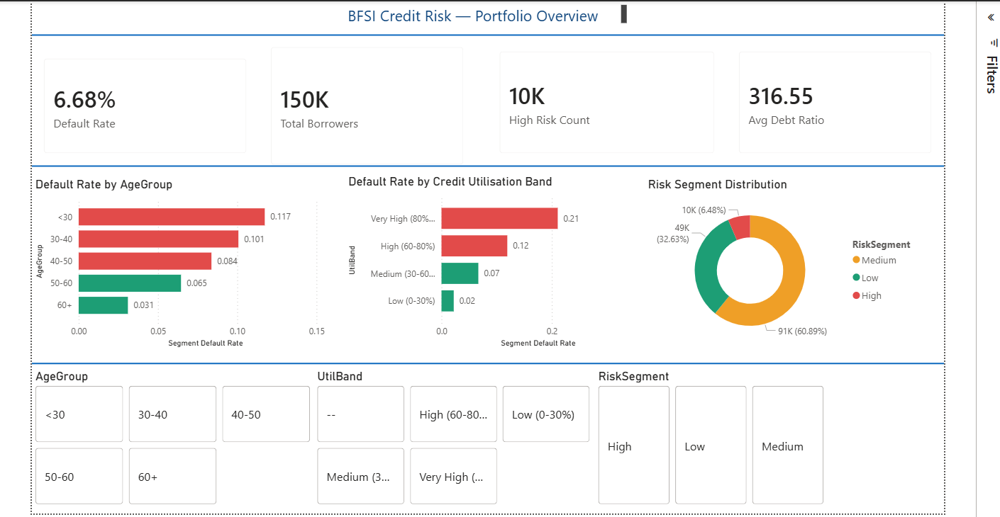
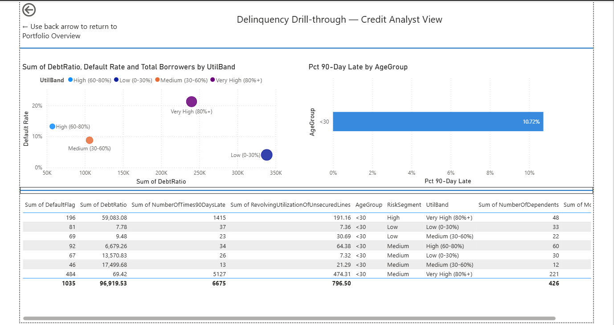
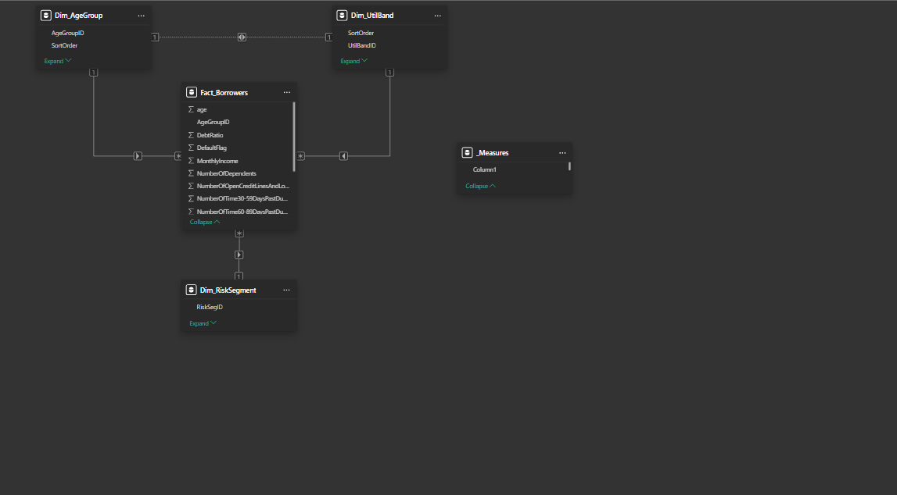

# BFSI-Credit-Risk-Analysis-Dashboard
BFSI Credit Risk Analysis Dashboard using Power BI, SQL &amp; DAX | 150K borrower records | Star Schema | RLS | Default risk insights

📊 BFSI Credit Risk Analysis Dashboard
🔍 Overview

This project focuses on analyzing credit risk in the BFSI domain using a dataset of 150,000 borrower records. The goal is to identify high-risk customers, monitor default patterns, and simulate real-world compliance reporting using Power BI, SQL, and DAX.

🎯 Objectives
Identify high-risk borrower segments
Analyze default rates across customer groups
Build a scalable data model (Star Schema)
Implement Row-Level Security (RLS) for restricted data access
Create an interactive dashboard for stakeholders

🛠️ Tech Stack
SQL – Data extraction & transformation
Power BI – Data visualization & dashboarding
DAX – Calculated measures & KPIs
Data Modeling – Star Schema design

📂 Dataset Details
Records: 150,000 borrowers
Domain: BFSI (Banking, Financial Services, Insurance)
Key Features:
Credit utilization
Loan amount
Income level
Default status
Risk segmentation


📈 Key Metrics & Insights
Default Rate: 6.73%
High-Risk Customers: 8,942 identified
Risk Distribution:
Low Risk
Medium Risk
High Risk
Insight: Higher credit utilization (>80%) shows significantly increased default probability


📊 Dashboard Features
Credit Risk Overview (KPIs)
Default Rate by Customer Segments
Credit Utilization Analysis
Risk Segmentation (Low / Medium / High)
Interactive Filters for deep analysis


🔐 Security Implementation
Implemented Row-Level Security (RLS)
Ensures users can only view data relevant to their role
Simulates real-world BFSI compliance standards


🧠 Data Model
Designed using Star Schema
Fact Table: Loan / Credit Data
Dimension Tables: Customer, Geography, Risk Category
Improves performance and scalability


🚀 Business Impact
Helps financial institutions reduce default risk
Enables data-driven lending decisions
Supports regulatory compliance reporting
Improves risk monitoring efficiency


Credit risk analytics on 150K borrower records — Python EDA, star schema modelling, 8 DAX measures, and row-level security. Built to mirror BFSI compliance reporting workflows.

> 🔗 **[https://www.novypro.com/create_project/upi-defect-tracker-dashboard](#)** ← replace with your link

---

## Key Findings

- Borrowers with **80%+ credit utilisation** default at **21.08%** — 3.16× the portfolio average
- **Under-30 age group** shows highest default rate at **11.56%**
- DebtRatio alone is insufficient — dashboard combines it with UtilBand for risk segmentation
- RLS restricts Credit Analyst view to High Risk segment only

---

## What's Inside

| Layer | Detail |
|---|---|
| Python EDA | Data cleaning, outlier treatment, feature engineering (AgeGroup, UtilBand, RiskSegment) |
| Data Model | Star schema — 1 fact table + 3 dimension tables |
| DAX Measures | 8 measures including Default Rate vs Avg (drives conditional formatting) |
| Dashboard | 2 pages — Portfolio Overview (executive) + Delinquency Drill-through (analyst) |
| RLS | Credit_Analyst (High risk only) · Portfolio_Manager (full access) |

---

## Screenshots

### Page 1 — Portfolio Overview


### Page 2 — Delinquency Drill-through


### Data Model — Star Schema


### RLS Setup


### Charts
screenshots/chart1_default_rate_by_age

screnshots/chart2_default_rate_by_utilband

screenshots/chart3_debtratio_distribution

screnshots/chart4_monthlyincome_distribution

---

## Repo Structure

```
├── data/                   # clean_credit.csv (raw CSV excluded — see .gitignore)
├── docs/                   # data_preparation.md
├── notebooks/              # eda_cleaning.ipynb
├── screenshots/            # dashboard screenshots
└── README.md
```

> Raw dataset (`cs-training.csv`) not included — download from [Kaggle](https://www.kaggle.com/c/GiveMeSomeCredit/data) and place in `data/`

---

## Tools

Python · Pandas · Seaborn · Power BI · DAX · Power Query · Power BI Service · Git

---

*Part of a BFSI analytics portfolio — [LinkedIn](https://www.linkedin.com/in/anuja-iraj/)*

📌 Future Enhancements
Add Machine Learning model for risk prediction
Integrate real-time data pipeline
Enhance dashboard with forecasting visuals


🙋‍♀️ About Me

I’m a Data Analyst / SQL Developer with experience in BFSI analytics, focusing on transforming raw data into actionable insights using SQL, Python, and Power BI.

⭐ If you found this project useful, consider giving it a star!
